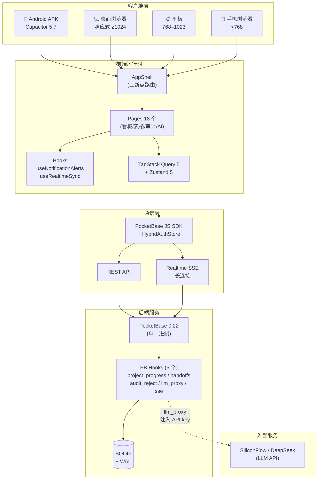
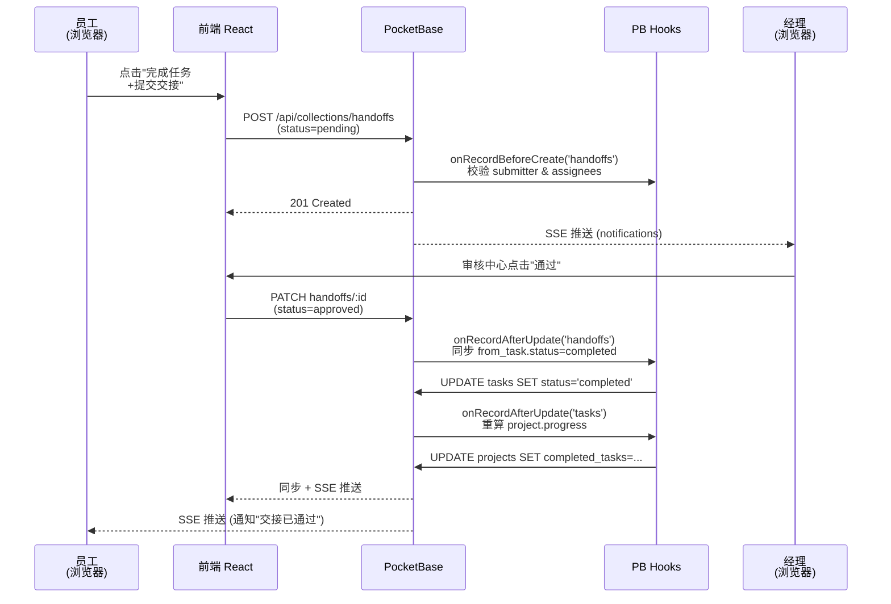
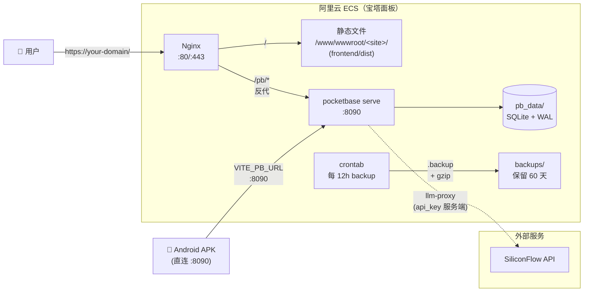
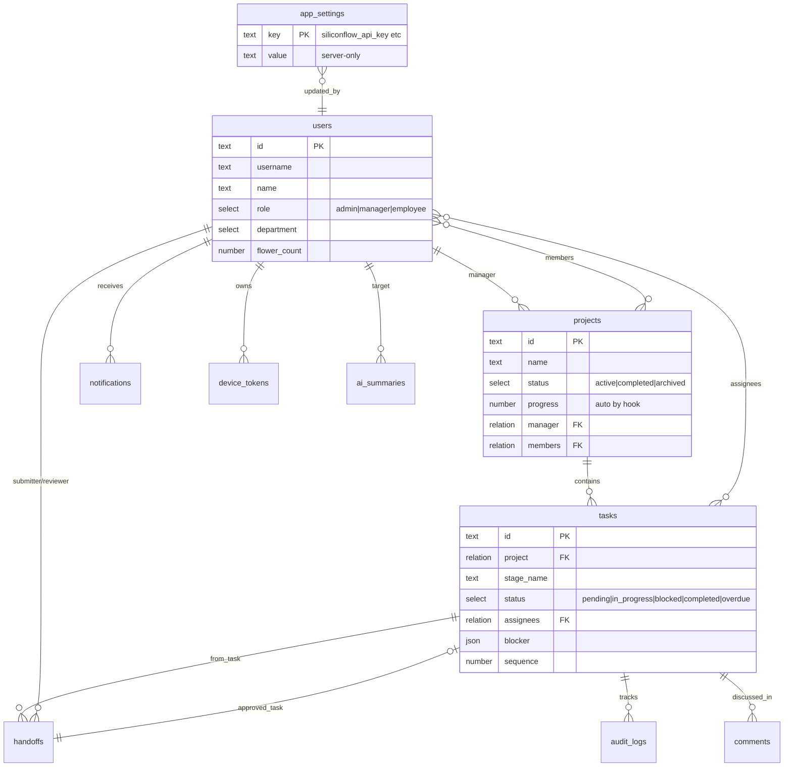

# 工程结算管理系统

> 基于 React + PocketBase 的移动优先项目管理系统，专为工程结算场景设计。


## 功能特性

- **响应式三端布局** *(v3.0+)* — 移动端 / 平板 / 桌面自动切换，桌面端 Sidebar+TopBar 三区布局
- **角色权限体系** — 经理/管理员全权管理，员工受限视图
- **项目看板** — 拖拽式任务管理（待处理/进行中/卡点/已完成），桌面端拖拽脉冲呼吸视觉反馈
- **任务表格视图** *(v3.0+)* — 桌面端 TanStack Table 排序 + 多选 + 批量改状态/删除
- **时间轴/甘特图** — 项目进度可视化，支持移动端横屏
- **批量任务编辑** — 三列表格一次性设置多个任务
- **实时数据同步** — PocketBase Realtime SSE 自动刷新
- **Android 后台通知** *(v3.0+)* — 原生前台服务保活，不依赖 Firebase/FCM，国产 ROM 友好
- **变更审计中心** — 所有变动可追溯，支持已阅/通过复核
- **全员消息通知** — 项目内任何变动自动通知全体成员
- **AI 智能分析** — 基于 SiliconFlow / DeepSeek，**v3.04 起 API key 服务端代理**（不暴露浏览器）
- **HybridAuthStore** *(v3.04)* — "不记住登录"时 token 走 sessionStorage（关浏览器即清）
- **5 个 PB hooks 兜底层** *(v3.0+)* — handoff 状态同步 / audit reject 回滚 / project.progress 自动重算 / LLM proxy / SSE
- **自动备份** — 每 12 小时备份，保留 60 天
- **移动端适配** — Capacitor 打包 Android APK，PWA 支持

## 系统架构

### 整体分层



### 数据流（任务交接闭环示例）



### 部署拓扑（生产）



## v3.0 - v3.04 改造（2026-05-16）

历经 4 轮夜间自主作业，58 个 commit，修复 30+ bug。完整 changelog 见 [docs/CHANGELOG.md](./docs/CHANGELOG.md) v3.0-v3.04 章节。简版：

- **PR 1**：通知一期收尾，全局 `useNotificationAlerts` hook，前台 Toast/振动/三音调/红闪/系统通知统一链路
- **PR 2**：Android 原生前台服务 + PocketBase Realtime SSE 长连接，**不依赖 Firebase**
- **PR 3**：响应式 AppShell 三断点（mobile/tablet/desktop），桌面 Sidebar+TopBar 布局
- **PR 4**：桌面任务表格视图 + 批量操作（标记完成/删除）
- **PR 5**：看板桌面体验提升，拖拽脉冲呼吸动画
- **v3.04 安全收尾**：C1 LLM API key 服务端代理 / C2 HybridAuthStore / 6 PB hooks 兜底 / Bundle gzip -90%

**当前 APK**：`EngineeringPMS_v3.04_production_ready.apk`（versionCode 44 / 6.94 MB）

## 快速开始

### 环境要求

- Node.js >= 18
- PocketBase >= 0.22

### 1. 启动后端

```bash
# Linux
cd pocketbase
./pocketbase serve --http=0.0.0.0:8090

# Windows
cd backend
启动后端.bat
```

### 2. 初始化数据库

```bash
cd scripts
npm install
node database_rebuild.mjs
```

### 3. 启动前端

```bash
cd frontend
npm install
npm run dev
```

访问 http://localhost:5173

### 一键启动（Windows）

```bash
START.bat
```

## 测试账号

| 角色 | 账号 | 密码 |
|------|------|------|
| 管理员 | admin_boss | 12345678 |
| 经理 | zhang_manager / wang_manager / mgr_li | 12345678 |
| 员工 | chen_doc / li_audit / zhao_site | 12345678 |

## 项目结构

```
├── frontend/          # React 前端应用
│   ├── src/
│   │   ├── lib/       # 核心库（API、PocketBase、状态管理）
│   │   ├── pages/     # 页面组件（18 个）
│   │   └── components/# 可复用组件（12 个）
│   └── public/        # 静态资源
├── backend/           # PocketBase 后端配置
│   ├── pb_data/       # 数据库（运行时生成）
│   ├── pb_migrations/ # 数据库迁移文件（36 个）
│   └── pb_hooks/      # 服务端 JS hooks（5 个文件 / 8 handler）
├── pocketbase/        # PocketBase 可执行文件
├── scripts/           # 运维脚本（备份、数据库重建等）
└── docs/              # 项目文档
```

### 数据库实体关系（v3.04）



## 技术栈

| 层级 | 技术 |
|------|------|
| 前端框架 | React 19 + TypeScript |
| 构建工具 | Vite 6 |
| UI 组件库 | Ant Design Mobile |
| 状态管理 | TanStack Query + Zustand |
| 拖拽 | @dnd-kit |
| 图表 | ECharts + Recharts |
| 后端 | PocketBase (SQLite) |
| AI | SiliconFlow / DeepSeek |
| 移动端 | Capacitor (Android) |

## 部署

**首次部署：** 详见 [宝塔部署操作手册](docs/宝塔部署操作手册.md)（含 PocketBase Linux 二进制上传、前端站点配置、Nginx 反代等）。

**已上线后增量升级（最常见）：** 见同文档"⭐ v3.04 增量升级流程"章节。最常用场景是**只更新前端**：
1. 本地 `npm run build`
2. 上传 `frontend/dist/` 内容覆盖 `/www/wwwroot/<站点>/`
3. 浏览器强刷 — 不需要重启 PocketBase

**APK 安装：** 把 `EngineeringPMS_v3.04_production_ready.apk` 发到手机安装；按 [docs/android-background-keepalive.md](docs/android-background-keepalive.md) 加电池白名单 + 自启动权限。

### 自动备份

数据库每 12 小时自动备份一次，保留 60 天（约 120 份），使用 sqlite3 `.backup` 确保 WAL 数据完整。

**Linux（crontab）：**

```bash
# 方式一：Node 脚本（跨平台，支持 gzip 压缩）
0 */12 * * * cd /path/to/project && node scripts/auto_backup.mjs >> /var/log/pb_backup.log 2>&1

# 方式二：Shell 脚本（轻量）
0 */12 * * * /path/to/backend/backup.sh >> /var/log/pb_backup.log 2>&1
```

**Windows（计划任务）：**

```powershell
schtasks /create /tn "PB_Backup" /tr "powershell -File C:\path\to\backend\backup.ps1" /sc hourly /mo 12
```

**环境变量（可选，用于 `auto_backup.mjs`）：**

| 变量 | 说明 | 默认值 |
|------|------|--------|
| `PB_DATA_DIR` | pb_data 目录路径 | Linux: `/www/server/pocketbase/pb_data`，其他: `../backend/pb_data` |
| `BACKUP_DIR` | 备份存放目录 | `../backups` |
| `KEEP_DAYS` | 保留天数 | `60` |

### Android APK 打包

详见 [docs/android-apk.md](docs/android-apk.md)。

## 文档（精简后清单）

| 文档 | 说明 |
|------|------|
| [docs/CHANGELOG.md](docs/CHANGELOG.md) | **完整版本变更记录**（含 v3.0-v3.04 详细修复列表） |
| [docs/宝塔部署操作手册.md](docs/宝塔部署操作手册.md) | 服务器首次部署 + v3.04 增量升级 |
| [docs/代码架构文档.md](docs/代码架构文档.md) | 完整技术架构与文件说明 |
| [docs/数据库设计_PocketBase版.md](docs/数据库设计_PocketBase版.md) | PocketBase 集合与字段设计 |
| [docs/产品完整文档_v2.3.md](docs/产品完整文档_v2.3.md) | 产品功能 & 业务流程（v2.3 起持续维护） |
| [docs/用户使用指南.md](docs/用户使用指南.md) | 终端用户操作手册 |
| [docs/需求实现对照表.md](docs/需求实现对照表.md) | 需求与实现的逐项映射 |
| [docs/notification-push-phase2.md](docs/notification-push-phase2.md) | Android 后台推送架构（PR 2 SSE + 前台服务） |
| [docs/android-background-keepalive.md](docs/android-background-keepalive.md) | 国产 ROM 保活引导（11 家厂商） |
| [docs/android-apk.md](docs/android-apk.md) | APK 打包流程 |
| [docs/数据模拟指南.md](docs/数据模拟指南.md) | 测试数据生成 |
| [docs/开源项目管理软件调研报告.md](docs/开源项目管理软件调研报告.md) | 选型调研参考 |

> 夜间作业临时产物（12 个 agent 报告 + 4 个 round summary + 26 轮 E2E 测试日志）已归档至 `_archive/overnight_2026-05-16/`。

## 许可证

[MIT](LICENSE)
