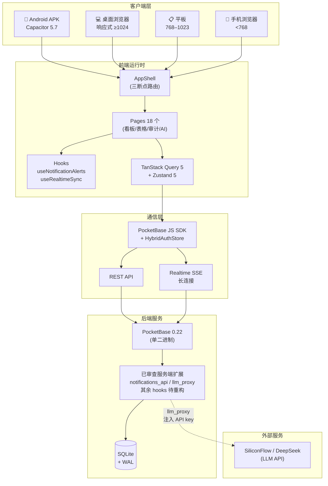
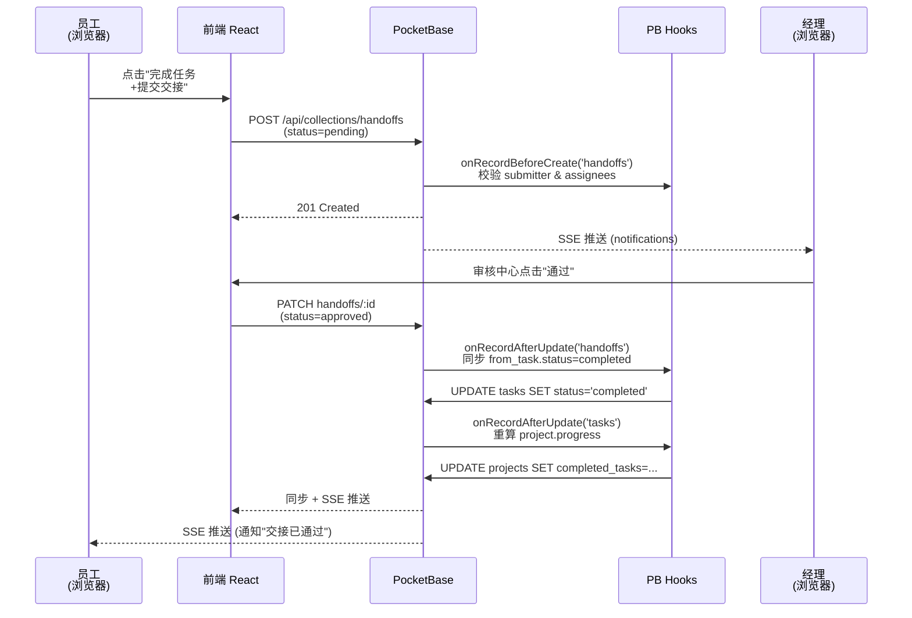
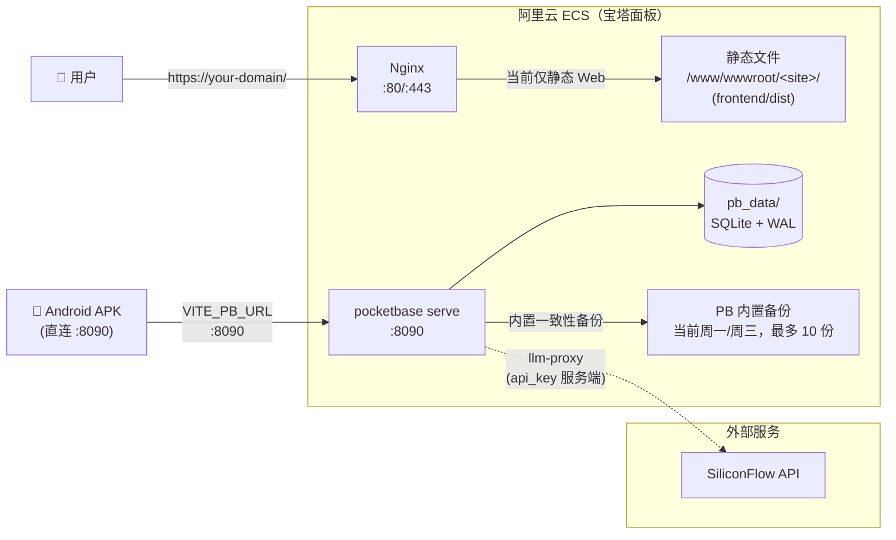
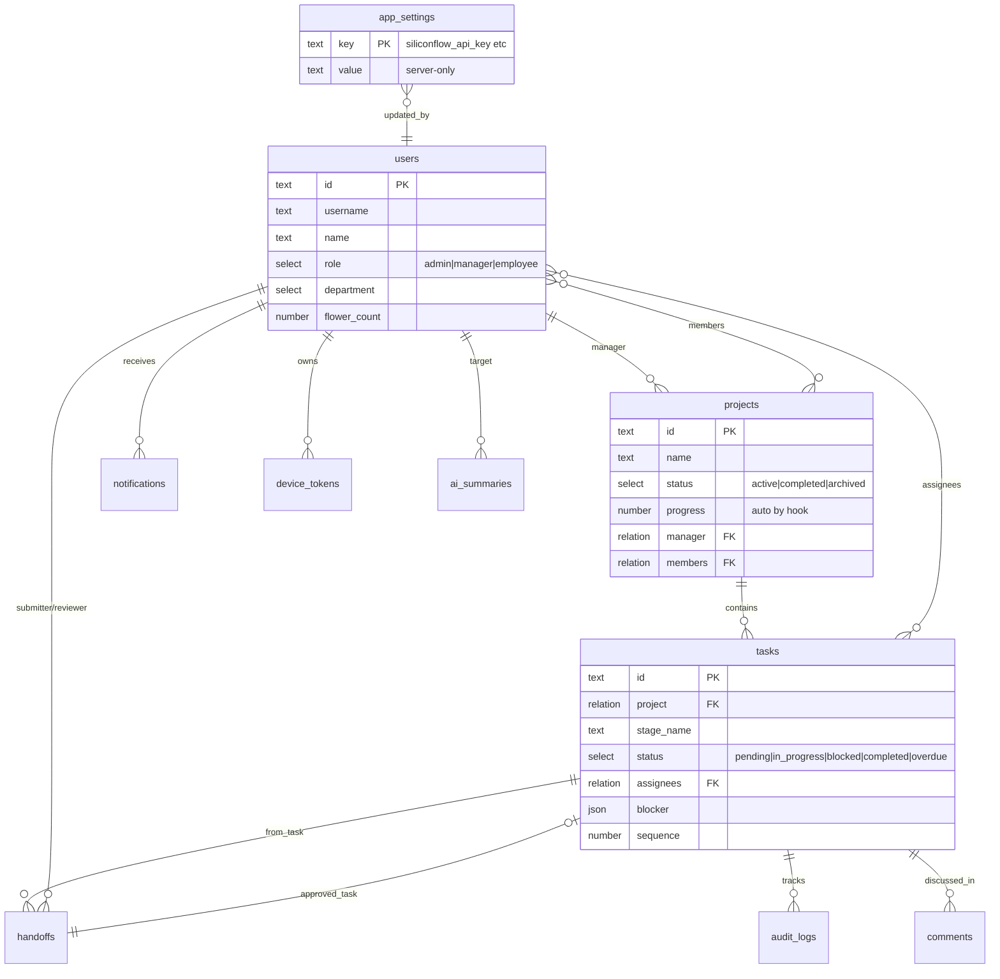

# 工程结算管理系统

> 基于 React + PocketBase 的移动优先项目管理系统，专为工程结算场景设计。

> 当前交付状态（2026-07-12）：功能分支已完成统一导航、数据流与响应式测试，并于 17:02 发布生产 Web；PocketBase systemd、生产权限 reconciliation、可信通知和 LLM 代理已上线。AI 还需要在 PB Admin UI 配置新的有效 SiliconFlow Key。APK 当前是内部测试 debug 包，不是正式 release。生产操作以 [宝塔部署与运维手册](docs/宝塔部署操作手册.md) 为准。


## 功能特性

- **响应式三端布局** *(v3.0+)* — 移动端 / 平板 / 桌面自动切换，桌面端 Sidebar+TopBar 三区布局
- **角色权限体系** — 经理/管理员全权管理，员工受限视图
- **项目看板** — 拖拽式任务管理（待处理/进行中/卡点/已完成），桌面端拖拽脉冲呼吸视觉反馈
- **任务表格视图** *(v3.0+)* — 桌面端 TanStack Table 排序 + 多选 + 批量改状态/删除
- **时间轴/甘特图** — 项目进度可视化，支持移动端横屏
- **批量任务编辑** — 三列表格一次性设置多个任务
- **实时数据同步** — PocketBase Realtime SSE 自动刷新
- **Android 后台通知** *(v3.0+)* — 原生前台服务保活，不依赖 Firebase/FCM，国产 ROM 友好
- **变更审计中心** — 所有变动可追溯，支持已阅/通过复核
- **全员消息通知** — 项目内任何变动自动通知全体成员
- **AI 智能分析** — 已移除浏览器密钥与直连 fallback；生产服务端代理已上线，需配置新的有效 SiliconFlow Key
- **HybridAuthStore** *(v3.04)* — "不记住登录"时 token 走 sessionStorage（关浏览器即清）
- **服务端可信命令** — 通知创建与 LLM 调用先在生产数据库副本验收，再逐文件部署
- **一致性备份** — PocketBase 内置备份 + 发布前冷备；必须检查实际文件时间和 `quick_check`
- **移动端适配** — Capacitor 打包 Android APK，PWA 支持

## 系统架构

### 整体分层


```mermaid
flowchart TB
    subgraph 客户端层
        Mobile["📱 Android APK<br/>Capacitor 5.7"]
        Desktop["💻 桌面浏览器<br/>响应式 ≥1024"]
        Tablet["📋 平板<br/>768–1023"]
        Phone["📱 手机浏览器<br/>&lt;768"]
    end

    subgraph 前端运行时
        AppShell["AppShell<br/>(三断点路由)"]
        Pages["Pages 18 个<br/>(看板/表格/审计/AI)"]
        Hooks["Hooks<br/>useNotificationAlerts<br/>useRealtimeSync"]
        State["TanStack Query 5<br/>+ Zustand 5"]
    end

    subgraph 通信层
        SDK["PocketBase JS SDK<br/>+ HybridAuthStore"]
        SSE["Realtime SSE<br/>长连接"]
        HTTP["REST API"]
    end

    subgraph 后端服务
        PB["PocketBase 0.22<br/>(单二进制)"]
        Hooks5["已审查服务端扩展<br/>notifications_api / llm_proxy<br/>其余 hooks 待重构"]
        SQLite[("SQLite<br/>+ WAL")]
    end

    subgraph 外部服务
        LLM["SiliconFlow / DeepSeek<br/>(LLM API)"]
    end

    Mobile & Desktop & Tablet & Phone --> AppShell
    AppShell --> Pages
    Pages --> Hooks
    Pages --> State
    State --> SDK
    SDK --> HTTP
    SDK --> SSE
    HTTP & SSE --> PB
    PB --> Hooks5
    Hooks5 --> SQLite
    Hooks5 -. "llm_proxy<br/>注入 API key" .-> LLM
```

### 数据流（任务交接闭环示例）


```mermaid
sequenceDiagram
    participant E as 员工<br/>(浏览器)
    participant FE as 前端 React
    participant PB as PocketBase
    participant H as PB Hooks
    participant M as 经理<br/>(浏览器)

    E->>FE: 点击"完成任务<br/>+提交交接"
    FE->>PB: POST /api/collections/handoffs<br/>(status=pending)
    PB->>H: onRecordBeforeCreate('handoffs')<br/>校验 submitter & assignees
    PB-->>FE: 201 Created
    PB-->>M: SSE 推送 (notifications)
    M->>FE: 审核中心点击"通过"
    FE->>PB: PATCH handoffs/:id<br/>(status=approved)
    PB->>H: onRecordAfterUpdate('handoffs')<br/>同步 from_task.status=completed
    H->>PB: UPDATE tasks SET status='completed'
    PB->>H: onRecordAfterUpdate('tasks')<br/>重算 project.progress
    H->>PB: UPDATE projects SET completed_tasks=...
    PB-->>FE: 同步 + SSE 推送
    PB-->>E: SSE 推送 (通知"交接已通过")
```

### 部署拓扑（生产）


```mermaid
flowchart LR
    User["👤 用户"]

    subgraph 阿里云ECS["阿里云 ECS（宝塔面板）"]
        Nginx["Nginx<br/>:80/:443"]
        Static["静态文件<br/>/www/wwwroot/&lt;site&gt;/<br/>(frontend/dist)"]
        PB["pocketbase serve<br/>:8090"]
        DB[("pb_data/<br/>SQLite + WAL")]
        Backup["PB 内置备份<br/>当前周一/周三，最多 10 份"]
    end

    subgraph 外部["外部服务"]
        SiliconFlow["SiliconFlow API"]
    end

    Android["📱 Android APK<br/>(直连 :8090)"]

    User -->|"https://your-domain/"| Nginx
    Nginx -->|"当前仅静态 Web"| Static
    Android -->|"VITE_PB_URL<br/>:8090"| PB
    PB --> DB
    PB -->|"内置一致性备份"| Backup
    PB -. "llm-proxy<br/>(api_key 服务端)" .-> SiliconFlow
```

## v3.0 - v3.04 改造（2026-05-16）

历经 4 轮夜间自主作业，58 个 commit，修复 30+ bug。完整 changelog 见 [docs/CHANGELOG.md](./docs/CHANGELOG.md) v3.0-v3.04 章节。简版：

- **PR 1**：通知一期收尾，全局 `useNotificationAlerts` hook，前台 Toast/振动/三音调/红闪/系统通知统一链路
- **PR 2**：Android 原生前台服务 + PocketBase Realtime SSE 长连接，**不依赖 Firebase**
- **PR 3**：响应式 AppShell 三断点（mobile/tablet/desktop），桌面 Sidebar+TopBar 布局
- **PR 4**：桌面任务表格视图 + 批量操作（标记完成/删除）
- **PR 5**：看板桌面体验提升，拖拽脉冲呼吸动画
- **v3.04 安全收尾**：HybridAuthStore、服务端 AI/通知命令与权限 reconciliation、Bundle 拆分

**当前 APK**：`frontend/android/app/build/outputs/apk/debug/app-debug.apk`（versionCode 44，Debug 签名，仅内部测试）

## 快速开始

### 环境要求

- Node.js >= 18
- PocketBase >= 0.22

### 1. 启动后端

```bash
# Linux
cd pocketbase
./pocketbase serve --http=0.0.0.0:8090

# Windows
cd backend
启动后端.bat
```

### 2. 初始化本地演示数据库

> 以下命令会重建集合和演示数据，只允许全新本地/隔离测试库，严禁连接生产。

```bash
cd scripts
npm install
node database_rebuild.mjs
```

### 3. 启动前端

```bash
cd frontend
npm install
npm run dev
```

访问 http://localhost:5173

### 一键启动（Windows）

```bash
START.bat
```

## 本地演示账号

以下账号由本地初始化脚本创建，不是生产账号；生产密码不能从仓库推断。

| 角色 | 账号 | 密码 |
|------|------|------|
| 管理员 | admin_boss | 12345678 |
| 经理 | zhang_manager / wang_manager / mgr_li | 12345678 |
| 员工 | chen_doc / li_audit / zhao_site | 12345678 |

## 项目结构

```
├── frontend/          # React 前端应用
│   ├── src/
│   │   ├── lib/       # 核心库（API、PocketBase、状态管理）
│   │   ├── pages/     # 页面组件
│   │   └── components/# 可复用组件
│   └── public/        # 静态资源
├── backend/           # PocketBase 后端配置
│   ├── pb_data/       # 数据库（运行时生成）
│   ├── pb_migrations/ # 数据库迁移（生产只能逐文件审查上线）
│   └── pb_hooks/      # 服务端 JS 扩展（生产不能整目录覆盖）
├── pocketbase/        # PocketBase 可执行文件
├── scripts/           # 运维脚本（备份、数据库重建等）
└── docs/              # 项目文档
```

### 数据库实体关系（v3.04）


```mermaid
erDiagram
    users ||--o{ projects : "manager"
    users }o--o{ projects : "members"
    projects ||--o{ tasks : "contains"
    users }o--o{ tasks : "assignees"
    tasks ||--o{ handoffs : "from_task"
    handoffs }o--|| users : "submitter/reviewer"
    handoffs ||--o| tasks : "approved_task"
    tasks ||--o{ audit_logs : "tracks"
    tasks ||--o{ comments : "discussed_in"
    users ||--o{ notifications : "receives"
    users ||--o{ device_tokens : "owns"
    users ||--o{ ai_summaries : "target"
    app_settings }o--|| users : "updated_by"

    users {
        text id PK
        text username
        text name
        select role "admin|manager|employee"
        select department
        number flower_count
    }
    projects {
        text id PK
        text name
        select status "active|completed|archived"
        number progress "auto by hook"
        relation manager FK
        relation members FK
    }
    tasks {
        text id PK
        relation project FK
        text stage_name
        select status "pending|in_progress|blocked|completed|overdue"
        relation assignees FK
        json blocker
        number sequence
    }
    app_settings {
        text key PK "siliconflow_api_key etc"
        text value "server-only"
    }
```

## 技术栈

| 层级 | 技术 |
|------|------|
| 前端框架 | React 19 + TypeScript |
| 构建工具 | Vite 6 |
| UI 组件库 | Ant Design Mobile |
| 状态管理 | TanStack Query + Zustand |
| 拖拽 | @dnd-kit |
| 图表 | ECharts + Recharts |
| 后端 | PocketBase (SQLite) |
| AI | SiliconFlow / DeepSeek |
| 移动端 | Capacitor (Android) |

## 部署

**生产部署：** 详见 [宝塔部署与生产运维手册](docs/宝塔部署操作手册.md)。线上已是 systemd + 专用账户，禁止再使用 `nohup/pkill`。

Web 发布必须经过本地测试、服务器 staging、当前版本备份、受控目录切换和深链接验证；不能先删除线上文件，也不能对站点根目录裸用 `rsync --delete`。

**APK：** 当前 debug 产物用于内部测试；构建、签名与真机清单见 [docs/android-apk.md](docs/android-apk.md)。仓库尚无 release keystore 时，不得把 APK 标成 production-ready。

### 生产备份

线上当前 PocketBase 内置计划是周一/周三 00:00、最多 10 份。配置存在不等于备份有效，必须检查最新文件时间；每次发布还要停服务做冷备并对备份库执行 `PRAGMA quick_check`。完整命令见生产手册。

### Android APK 打包

详见 [docs/android-apk.md](docs/android-apk.md)。

## 文档（精简后清单）

| 文档 | 说明 |
|------|------|
| [docs/CHANGELOG.md](docs/CHANGELOG.md) | **完整版本变更记录**（含 v3.0-v3.04 详细修复列表） |
| [docs/宝塔部署操作手册.md](docs/宝塔部署操作手册.md) | 服务器首次部署 + v3.04 增量升级 |
| [docs/代码架构文档.md](docs/代码架构文档.md) | 完整技术架构与文件说明 |
| [docs/数据库设计_PocketBase版.md](docs/数据库设计_PocketBase版.md) | PocketBase 集合与字段设计 |
| [docs/产品完整文档_v2.3.md](docs/产品完整文档_v2.3.md) | 产品功能 & 业务流程（v2.3 起持续维护） |
| [docs/用户使用指南.md](docs/用户使用指南.md) | 终端用户操作手册 |
| [docs/需求实现对照表.md](docs/需求实现对照表.md) | 需求与实现的逐项映射 |
| [docs/notification-push-phase2.md](docs/notification-push-phase2.md) | Android 后台推送架构（PR 2 SSE + 前台服务） |
| [docs/android-background-keepalive.md](docs/android-background-keepalive.md) | 国产 ROM 保活引导（11 家厂商） |
| [docs/android-apk.md](docs/android-apk.md) | APK 打包流程 |
| [docs/数据模拟指南.md](docs/数据模拟指南.md) | 测试数据生成 |
| [docs/开源项目管理软件调研报告.md](docs/开源项目管理软件调研报告.md) | 选型调研参考 |

> 夜间作业临时产物（12 个 agent 报告 + 4 个 round summary + 26 轮 E2E 测试日志）已归档至 `_archive/overnight_2026-05-16/`。

## 许可证

[MIT](LICENSE)
