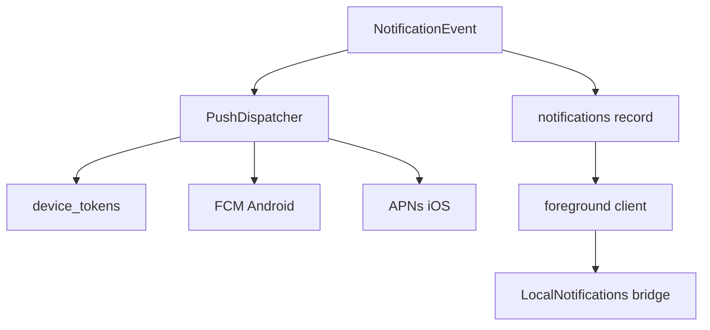

# 通知二期架构说明

## 一期与二期边界

当前代码中的提醒能力分为两层：

- 一期：PocketBase `notifications` 记录 + 前台已打开 App 的本地提醒
- 二期：App 在后台、锁屏或被系统清理后，仍能收到真正的系统推送

一期已覆盖：

- 未读角标
- 通知列表
- 前台 Toast
- 振动
- 红边闪烁
- `LocalNotifications` 本地提醒桥接

一期**不**覆盖：

- 后台/离线推送
- 厂商通知通道保活
- APNs / FCM 服务端下发

## 推荐二期架构

## 服务端建议

新增一个设备令牌集合，例如 `device_tokens`：

- `user`：relation -> users
- `platform`：`android | ios | web`
- `token`：push token
- `device_name`：可选
- `last_seen_at`：date
- `is_active`：bool

服务端职责：

1. 业务操作先创建 `notifications` 记录
2. 根据 `user` 查 `device_tokens`
3. 通过 `PushDispatcher` 调 FCM / APNs
4. 失败时只记录日志，不影响主业务写库

## 客户端建议

App 登录后：

1. 获取推送权限
2. 获取设备 token
3. 上报到 `device_tokens`

App 登出后：

1. 注销当前 token 或标记 `is_active = false`

前台职责：

- 仍保留 `Home.tsx` 的未读数监听
- 前台收到同源通知事件时，触发 Toast / 振动 / 红边闪烁

后台职责：

- 只依赖服务端推送
- 不再把 `LocalNotifications.schedule()` 误当成后台真推送

## 落地顺序

1. 先完成当前一期通知链路收敛
2. 新建设备 token schema 与注册流程
3. 引入推送分发服务
4. 将“任务分配 / 审核拒绝 / 卡点协助”等事件统一接入 `PushDispatcher`
5. 做安卓真机后台验证

## 实现原则

- `notifications` 记录是消息事实来源
- Push 发送是派生行为，不反向驱动业务
- 前台提醒和后台推送共享同一个领域事件，但各自职责独立
- 页面层不直接处理推送 token 与通知发送细节

## 当前仓库已完成的二期基础

- 新增 PocketBase 集合迁移：`device_tokens`
- 客户端接入 `@capacitor/push-notifications`
- 登录态建立后自动尝试注册 push token
- 登出前停用当前设备 token，避免脏设备记录残留
- 为避免未配 Firebase 时 Android 登录后闪退，真 push 注册默认关闭；只有设置 `VITE_ENABLE_PUSH_REGISTRATION=1` 后才启用

## 仍需你准备的外部条件

仅完成“客户端注册链路”还不能形成后台真推送，Android 端还需要：

1. Firebase 项目
2. `google-services.json`
3. Android 端对应 Firebase 配置
4. 服务端推送发送器（FCM HTTP v1 或网关）

若未配置 Firebase，当前代码会优雅降级为：

- 应用可正常运行
- Push 注册失败只记录日志
- 不会影响现有前台本地提醒链路
- 默认不会触发 `PushNotifications.register()`，从而避免无 `google-services.json` 时的原生崩溃
