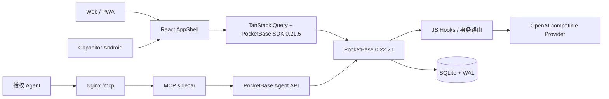

# 代码架构

## 运行时



PocketBase Server `0.22.21` 与 JS SDK `0.21.5` 是本版本的兼容组合。不要只升级其中一端。

## 前端

- `frontend/src/App.tsx`：路由、旧链接兼容和角色守卫。
- `frontend/src/components/layout/AppShell.tsx`：唯一主导航拥有者。
- `frontend/src/lib/navigation.ts`：无 React/DOM 的角色、路由和跨端导航模型。
- `frontend/src/lib/pocketbase.ts`：生产 URL 解析、HybridAuthStore 和实时连接。
- `frontend/src/lib/api.ts`：Query/Mutation 与自定义事务路由封装。
- `frontend/src/pages/ProjectDetail.tsx`：项目总览和二级视图入口。
- `frontend/src/components/kanban/*`：看板、任务详情、完成交接与卡点表单。
- `frontend/src/pages/ProjectTimeline.tsx`：泳道、筛选、缩放和任务定位。
- `frontend/src/pages/admin/*`：用户、AI Provider、数据导入和系统工作台。

路由重点：

```text
/app                     角色化工作台
/my-tasks                我的任务
/my-projects             项目列表
/project/:id             项目详情
/project/:id/kanban      看板
/project/:id/timeline    时间轴
/task/:id                任务详情
/notifications           通知
/review-center           交接审核/审计阅读
/me                      我的资料
/system/users            用户管理（admin）
/system/ai               AI Provider（admin）
/system/import           数据导入（admin）
```

旧 `/manager`、`/admin` 和旧 tab 链接由路由兼容层重定向，不再拥有独立导航。

## 身份与存储

- Web 保持登录：token 写 `localStorage`。
- Web 不保持登录：token 只写 `sessionStorage`。
- App 始终持久化，退出账号后清理。
- 启动时执行 auth refresh；只有明确的 400/401/403 才清会话，网络超时不误登出。
- 服务端 Hook 在密码认证和 refresh 前检查 `is_active`；首次登录或管理员重置后，只允许先完成强制改密。

## 服务端状态机

浏览器不得用多次 REST 更新拼装以下流程：

| 路由 | 事务内容 |
|---|---|
| `POST /api/custom/tasks/complete-with-handoff` | 完成任务、创建 pending 交接、审计、通知 |
| `POST /api/custom/tasks/block` | 标卡点、回退前序任务、审计、通知 |
| `POST /api/custom/tasks/unblock` | 解阻、恢复前序任务、审计、通知 |
| `POST /api/custom/handoffs/decide` | 一次性通过/驳回、创建唯一后续任务、成员同步、审计、通知 |
| `POST /api/custom/tasks/delete` | 清理依赖、删除任务、重算进度、通知、审计 |

迁移会锁住 handoff 直接更新、任务直接删除和项目永久删除。看板拖到“完成/卡点”只打开详情表单，不直接改状态。

## 通知

- 可信通知由 `notifications_api.pb.js` 或事务 Hook 创建。
- 用户只能读写自己的通知；浏览器不能伪造通知给其他用户。
- PocketBase Realtime SSE 负责前台刷新，原生桥接负责 App 后台提醒。
- 通知分页以服务端 `getList` 为准，不在前端先拉全量再分页。

## LLM

- `llm_proxy.pb.js` 提供配置读取、admin 配置写入和模型调用。
- Provider 使用 `provider / base_url / default_model / api_key`，兼容任意 OpenAI-compatible `/chat/completions`。
- API Key 仅保存在 PocketBase `app_settings`，配置响应只返回 `has_api_key`。
- 代理限制角色、消息数量、总字符、模型名、temperature 和 max_tokens，并对上游错误脱敏。

## MCP sidecar

- `mcp-server/` 提供无状态 Streamable HTTP MCP 服务，Node.js 20+ 运行，只监听 `127.0.0.1` 并由 Nginx 发布 HTTPS `/mcp`。
- 外层 MCP Bearer Token 与 PocketBase `service_accounts` 凭据分离，二者只存在服务器 `0600` 环境文件。
- sidecar 只调用 `/api/custom/agent/v1/*`；PocketBase 再校验服务账号启用状态、有效期、scope、所有者和允许项目。
- 高影响操作先预览，再用短时一次性确认码执行；写入使用幂等键并进入 `agent_operations` 和 `audit_logs`。当前 API 技术上允许同一 Agent 连续调用 preview 和 confirm，人工确认属于操作流程约束；Agent 不得自动串联这两个调用。
- Agent 不能访问 SQLite、用户密码、AI Key、PocketBase 管理后台或服务器控制面。
- 生产 `tools/list` 返回 20 个业务工具，不包含账号或系统管理工具。

## Android

- Capacitor `webDir=dist`，原生工程位于 `frontend/android`。
- `frontend/scripts/build-debug-apk.ps1` 要求显式传入后端 URL，并校验构建 JS 确实包含该 URL。
- release 构建必须存在未提交的 `android/keystore.properties`，否则 Gradle 主动失败。
- Android 后台通知不能只靠自动化；需验证通知权限、电池策略、杀进程恢复和网络重连。

## 测试

- Vitest：导航、权限模型、API、存储、组件和数据场景。
- Playwright：三角色、四种视口、旧链接、项目详情、资料页和手机时间轴。
- 隔离 PocketBase：迁移、权限负面测试、事务失败注入和并发审批。
- Gradle：Capacitor sync、Debug APK、签名与包内 URL 检查。
- MCP：Bearer/config/格式单测、TypeScript 构建，以及经 Nginx 的鉴权与真实工具调用。
