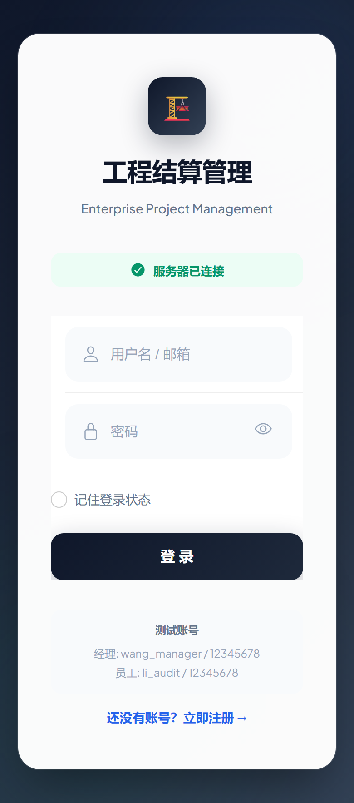
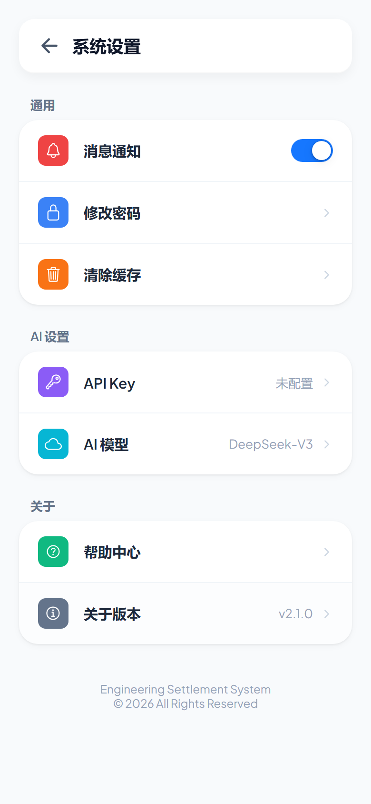
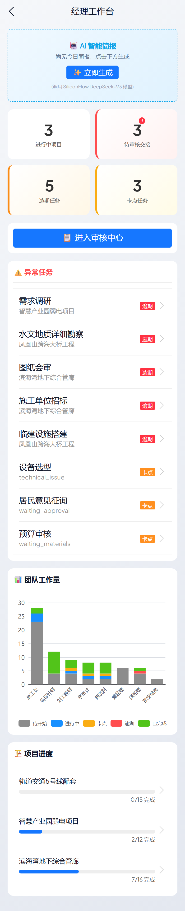
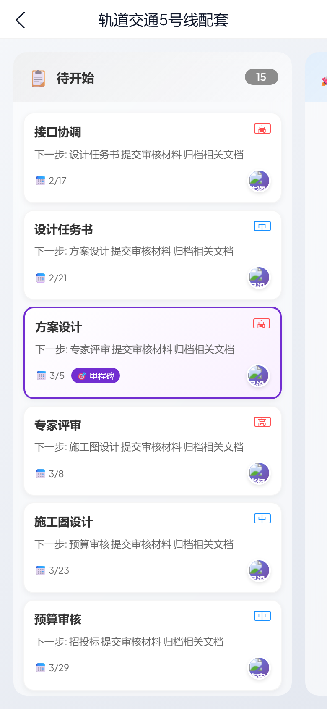
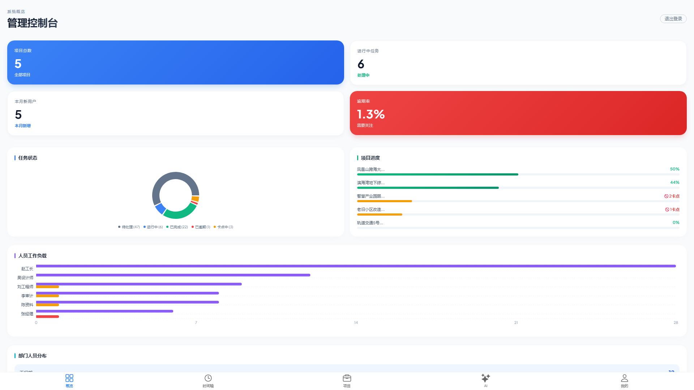
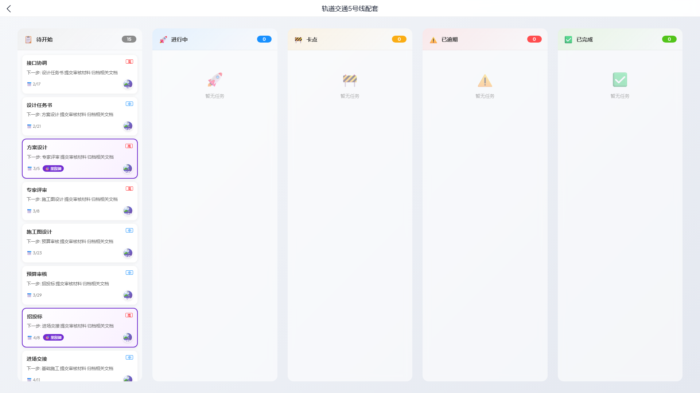

# 📱 工程项目管理系统 - 用户使用指南

> 本指南帮助经理和员工快速上手使用系统，包括基本操作、AI功能设置、手机端添加到主屏幕等完整说明。

---

## 目录

1. [系统访问方式](#1-系统访问方式)
2. [iPhone添加到主屏幕（推荐）](#2-iphone添加到主屏幕推荐)
3. [Android（推荐：直接安装 APK）](#3-android推荐直接安装-apk)
4. [登录系统](#4-登录系统)
5. [基本功能使用](#5-基本功能使用)
6. [AI智能功能使用](#6-ai智能功能使用)
7. [常见问题解答](#7-常见问题解答)

---

## 1. 系统访问方式

### 网页访问地址（PC / 手机浏览器都可用）

在浏览器中打开以下地址即可进入系统登录页：

```
http://{YOUR_SERVER}/login
```

- **PC**：Chrome / Edge 打开即可
- **手机**：Safari / Chrome 打开即可

> 💡 **提示**：如果输入 `http://{YOUR_SERVER}` 也会自动跳转到登录页。

### 推荐浏览器

| 设备 | 推荐浏览器 |
|------|-----------|
| iPhone | Safari（系统自带） |
| Android | Chrome 或 系统自带浏览器 |
| 电脑 | Chrome、Edge、Firefox |

---

## 2. iPhone添加到主屏幕（推荐）

将网页添加到主屏幕后，可以像使用普通App一样使用本系统，体验更好。

### 详细步骤（图文说明）

#### 第一步：打开Safari浏览器

1. 在iPhone主屏幕找到 **Safari** 图标（蓝色指南针图标）
2. 点击打开Safari浏览器

#### 第二步：输入网址

1. 点击顶部的**地址栏**
2. 输入系统网址：`http://{YOUR_SERVER}/login`
3. 点击键盘上的**前往**（或**Go**）

#### 第三步：打开分享菜单

1. 等待页面加载完成
2. 点击屏幕**底部中间**的 **分享按钮**（正方形带向上箭头的图标 ⬆️□）

#### 第四步：选择"添加到主屏幕"

1. 在弹出的菜单中，**向上滑动**查看更多选项
2. 找到并点击 **"添加到主屏幕"**（图标是 ➕）

#### 第五步：确认添加

1. 可以修改显示名称（建议保持默认或改为"项目管理"）
2. 点击右上角的 **"添加"**

#### 第六步：完成

现在主屏幕上会出现一个新图标，点击即可直接打开系统！

---

### 🎥 操作演示（文字版）

```
Safari → 输入网址 → 点击底部分享按钮(⬆️) → 添加到主屏幕 → 添加
```

### ⚠️ 注意事项

1. **必须使用Safari浏览器**，其他浏览器（如Chrome、微信内置浏览器）没有"添加到主屏幕"功能
2. 如果找不到"添加到主屏幕"选项，请向上滑动菜单查看
3. 添加后的图标和普通App一样，可以长按移动位置

---

## 3. Android（推荐：直接安装 APK）

> 如果管理员已经发给您 Android 安装包（`.apk`），建议直接安装使用，体验最好。

### 3.1 安装 APK（最推荐）

1. 在手机上找到收到的安装包，例如：`工程结算管理系统.apk`
   - 常见位置：微信/QQ“文件”、系统“下载(Download)”、文件管理器
2. 点击安装包 → 选择 **“安装”**
3. 如果系统提示“为了安全，禁止安装未知来源应用”：
   - 点击 **“设置/允许来自此来源”** → 开启允许 → 返回继续安装
4. 安装完成后点击 **“打开”**，以后可直接从桌面图标进入

> 💡 **更新提示**：安装新版 APK 前若提示冲突/无法覆盖，先卸载旧版本再安装新版。

### 3.2 不安装也能用（浏览器方式）

1. 打开 Chrome（或系统浏览器）
2. 输入网址：`http://{YOUR_SERVER}/login` 并访问
3. 右上角 **三个点** `⋮` → **“添加到主屏幕/安装应用”** → 确认

---

## 4. 登录系统

### 登录步骤

1. 打开系统（通过浏览器或主屏幕图标）
2. 在登录页面输入：
   - **用户名**：您的账号（如 `wang_manager`）
   - **密码**：您的密码（如 `12345678`）
3. 点击 **"登录"** 按钮

### 测试账号（仅供测试使用）

| 角色 | 用户名 | 密码 | 说明 |
|------|--------|------|------|
| 管理员/经理（演示） | wang_manager | 12345678 | 可访问管理控制台、经理工作台 |
| 员工（演示） | li_audit | 12345678 | 普通员工视角（只看自己任务） |

> ⚠️ **重要**：正式使用时请联系管理员获取您的专属账号

### 登录遇到问题？

| 问题 | 解决方法 |
|------|---------|
| 提示"用户名或密码错误" | 检查用户名和密码是否输入正确，注意大小写 |
| 页面加载不出来 | 检查网络连接，确认服务器地址正确 |
| 忘记密码 | 联系系统管理员重置密码 |

---

## 5. 基本功能使用

### 5.1 首页 - 我的工作台

登录后首先看到的是**工作台**页面，显示：

- 📊 **今日任务概览**：待处理、进行中、已完成的任务数量
- 📋 **我的任务列表**：您负责的所有任务
- 🔔 **最新通知**：系统消息和任务更新

### 5.2 任务管理

#### 查看任务

1. 点击底部导航栏的 **"任务"** 图标
2. 可以看到任务列表，分为不同状态：
   - 🟡 **待处理**：等待开始的任务
   - 🔵 **进行中**：正在处理的任务
   - 🟢 **已完成**：已经完成的任务
   - 🔴 **已逾期**：超过截止日期的任务

#### 更新任务状态

1. 点击任务卡片进入任务详情
2. 点击 **"更新状态"** 按钮
3. 选择新的状态
4. 可以添加备注说明
5. 点击确认保存

#### 看板视图（经理功能）

1. 点击顶部的 **"看板"** 标签
2. 可以拖拽任务卡片到不同列来改变状态
3. 直观查看所有任务的进度

### 5.3 项目管理（经理功能）

1. 点击底部导航栏的 **"项目"** 图标
2. 查看所有项目的进度和状态
3. 点击项目卡片查看详情和关联任务

### 5.4 个人中心

1. 点击底部导航栏的 **"我的"** 图标
2. 可以：
   - 查看个人信息
   - 修改头像
   - 设置AI密钥（见下节）
   - 退出登录

---

## 6. AI智能功能使用

### 6.1 AI功能介绍

系统集成了**AI智能助手**，可以帮助您：

- 📝 **自动生成工作周报**：一键总结本周工作内容
- 📊 **项目进度分析**：智能分析项目风险和建议
- 💬 **智能问答**：回答关于项目和任务的问题

### 6.2 设置AI密钥（重要！）

使用AI功能前，需要先设置API密钥。

#### 演示环境

如果您是演示/试用账号，请联系管理员获取 API Key，粘贴到 **系统设置 → API Key** 并保存即可。

> ⚠️ **安全提醒**：API Key 属于敏感信息，请勿公开转发或写入代码仓库；如需长期多人使用，建议为每个人单独生成 Key 并定期更换。

#### 获取密钥（详细步骤）

**第一步：访问SiliconFlow官网**

1. 打开浏览器，输入网址：`https://siliconflow.cn`
2. 点击页面右上角的 **"登录"** 或 **"注册"**

**第二步：注册账号（如果没有账号）**

1. 点击 **"注册"**
2. 输入您的：
   - 手机号码
   - 设置密码
   - 验证码
3. 点击 **"注册"** 完成

**第三步：登录并进入控制台**

1. 登录后，点击右上角头像或 **"控制台"**
2. 进入用户控制台页面

**第四步：创建API密钥**

1. 在左侧菜单找到 **"API密钥"** 或 **"API Keys"**
2. 点击 **"创建新密钥"** 或 **"Create API Key"**
3. 输入密钥名称（如"项目管理系统"）
4. 点击 **"创建"**

**第五步：复制并保存密钥**

1. 密钥创建后会显示一串以 `sk-` 开头的字符串
2. **立即复制保存**（只显示一次！）
3. 建议保存到手机备忘录或安全的地方

> ⚠️ **重要提醒**：
> - 密钥只显示一次，请务必立即保存
> - 如果忘记密钥，需要重新创建一个新的
> - 请勿将密钥分享给他人

> 💡 **提示**：SiliconFlow提供免费额度（新用户赠送约2000万tokens），足够日常使用很长时间

#### 设置密钥步骤

**方法一：在系统设置中配置（推荐）**

1. 登录系统后，点击底部导航栏的 **"我的"** 图标
2. 进入个人中心页面，点击 **"系统设置"** 或设置图标 ⚙️
3. 在设置页面找到 **"AI设置"** 区域
4. 点击 **"API Key"** 一项（右侧显示"未配置"）
5. 在弹出的输入框中**粘贴**您的密钥
   - 密钥格式类似：`sk-xxxxxxxxxxxxxxxxxxxx`
6. 点击 **"保存"** 按钮
7. 返回后看到 **"API Key"** 右侧显示"已配置"即成功

> 💡 **提示**：在同一页面还可以选择 AI 模型，默认使用 DeepSeek-V3

**方法二：在AI控制台页面设置**

1. 点击底部导航栏的 **"AI"** 图标，进入AI控制台
2. 如果显示 **"需要配置 SiliconFlow API Key"** 的橙色提示框
3. 在输入框中粘贴您的密钥
4. 点击 **"保存 Key"** 按钮
5. 提示框变为绿色显示"API Key: 已配置"即成功

**方法三：在经理工作台设置**

1. 如果您是经理角色，登录后会进入经理工作台
2. 在AI智能决策建议区域，如果提示需要配置API Key
3. 按照提示点击配置链接
4. 输入密钥并保存

#### 验证密钥是否生效

1. 进入 **"AI周报"** 或 **"AI助手"** 页面
2. 点击 **"生成报告"** 或发送一条消息
3. 如果正常返回结果，说明设置成功

### 6.3 使用AI生成周报

1. 点击底部导航栏进入 **"AI"** 或 **"报告"** 页面
2. 选择 **"生成周报"**
3. 选择要总结的时间范围（默认本周）
4. 点击 **"生成"** 按钮
5. 等待几秒钟，AI会自动生成周报内容
6. 可以**复制**或**分享**生成的报告

### 6.4 使用AI智能问答

1. 进入AI助手页面
2. 在输入框输入您的问题，例如：
   - "本周有哪些任务需要完成？"
   - "项目A的进度如何？"
   - "有哪些逾期任务需要处理？"
3. 点击发送，AI会根据系统数据回答您的问题

---

## 7. 常见问题解答

### Q1: 页面打不开怎么办？

**可能原因和解决方法**：

| 原因 | 解决方法 |
|------|---------|
| 网络未连接 | 检查WiFi或移动数据是否正常 |
| 服务器地址错误 | 确认输入的地址正确 |
| 服务器未启动 | 联系管理员检查服务器状态 |

### Q2: 登录后页面空白？

1. 尝试**刷新页面**（下拉刷新或点击刷新按钮）
2. **清除浏览器缓存**后重新登录
3. 如果还是不行，联系管理员

### Q2-补充：看到的界面还是老的/版本没更新怎么办？（清缓存）

有时浏览器会缓存旧的页面文件，按下面方法清理即可：

- **系统内一键清理（推荐）**：
  - 打开 **我的 → 系统设置 → 清除缓存**（会自动刷新页面）
- **电脑（Chrome/Edge）**：
  - 强制刷新：按 `Ctrl + F5`（或 `Shift + F5`）
  - 或者打开无痕窗口重新访问 `http://{YOUR_SERVER}/login`
- **iPhone（Safari）**：
  - 打开 `设置` → `Safari` → `清除历史记录与网站数据`
  - 或者 `设置` → `Safari` → `高级` → `网站数据`，搜索 `{YOUR_SERVER}` 并删除
- **iPhone 已“添加到主屏幕”的网页 App**：
  - 先删除桌面图标 → 重新用 Safari 打开网址 → 再次“添加到主屏幕”
- **Android（Chrome）**：
  - Chrome → `设置` → `隐私与安全` → `清除浏览数据`
  - 或者 Chrome → `站点设置` → `所有网站` → 找到 `{YOUR_SERVER}` → `清除并重置`

### Q3: AI功能提示"密钥无效"？

1. 检查密钥是否复制完整（没有多余空格）
2. 确认密钥没有过期
3. 尝试重新生成一个新密钥

### Q4: 任务状态无法更新？

1. 检查网络连接
2. 确认您有权限更新该任务
3. 刷新页面后重试

### Q5: 添加到主屏幕后打开是空白？

1. 确保添加时网页已完全加载
2. 删除主屏幕图标，重新添加
3. 检查网络连接

### Q6: 如何退出登录？

1. 点击底部 **"我的"**
2. 滑动到页面底部
3. 点击 **"退出登录"** 按钮

---

## 📞 技术支持

如遇到本指南未涉及的问题，请联系：

- **系统管理员**：请联系部署本系统的负责人
- **技术支持**：请联系本项目的实际维护者

---

## 📋 快速参考卡片

### 一句话开始使用（最常用）

- **网址**：`http://{YOUR_SERVER}/login`
- **管理员/经理（演示）**：`wang_manager` / `12345678`
- **员工（演示）**：`li_audit` / `12345678`

### iPhone添加到主屏幕

```
Safari打开网址 → 点击底部 ⬆️ 分享按钮 → 添加到主屏幕 → 添加
```

### Android（推荐：安装 APK）

```
点击安装包(.apk) → 允许安装未知来源（如提示）→ 安装 → 打开
```

### AI密钥设置

```
我的 → 系统设置 → API Key → 粘贴密钥 → 保存
```

### 更新任务状态

```
任务列表 → 点击任务 → 更新状态 → 选择新状态 → 确认
```

---

---

## 附录：系统界面预览

以下是系统主要界面的截图，帮助您提前熟悉系统：

### 登录页面


### 系统设置（AI密钥配置）


### 经理工作台


### 项目看板


### 管理控制台（PC版）


### 项目看板（PC版）


---

> 📅 文档更新日期：2026年3月4日  
> 📌 版本：v2.3
